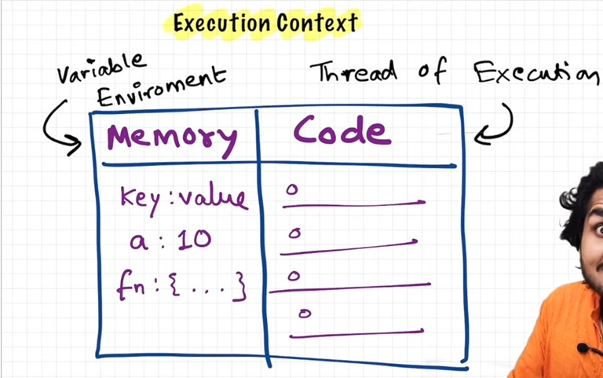

# How JavaScript Works & Execution Context

## “Everything in JavaScript happens inside an execution context”

- Execution context can be considered as a **“BIG BOX”** in which the whole JavaScript code is executed

- Execution context has 2 components   
- Component 1 : Memory 
    - Variables and functions are stored here as key value pairs 
    - Also known as **“variable environment”**
- Component 2 : Code 
    - The code is executed one line at a time here
    -  Also known as **“thread of execution”**

## “Is JavaScript Synchronous or Asynchronous ?”
- Synchronous programming means that if execution of any command is halted or waiting, then JS won't jump onto the next command. It will wait for the current command and then move forward. Until then all processes are halted.
- Asynchronous programming is a means of parallel programming in which a unit of work runs separately from the main application thread and notifies the calling thread of its completion, failure or progress.

## “Is JavaScript a single-threaded language or  multi-threaded?” 

- Single-threaded means JavaScript will execute only one command at a time.
- Synchronous - Single-threaded means that JS will execute the command one at a time but also in a particular sequence. 

### More links
 - [Namaste JavaScript Episode 1 - How JavaScript works and execution context](https://www.youtube.com/watch?v=ZvbzSrg0afE&list=PLlasXeu85E9cQ32gLCvAvr9vNaUccPVNP&index=2)
 - [Asynchronous Programming](https://nodejs.dev/learn/javascript-asynchronous-programming-and-callbacks)
 - [Synchronous and Asynchronous JavaScript](https://developer.mozilla.org/en-US/docs/Learn/JavaScript/Asynchronous/Introducing#synchronous_javascript)
