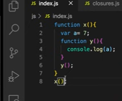
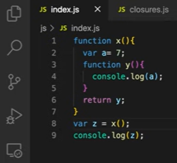

# Closures in JS

- Let’s understand closures by taking an example
- 

- In the code snippet above, we have a function `x()` and an inner function `y()`
- On executing this code, we get the output as
- 

- In this example, we are trying to log the value of `a` inside the function `y()`. But we know that `a` is not present in its local memory 
- As we have already learnt that whenever the JavaScript engine is not able to find something in the function’s local memory it then moves to memory of the lexical parent and fetches the value from there
- Hence, we get the output here as 7

- Wondering why we discussed this example?
    - Because that is exactly what a CLOSURE is!

    - Let's dive deep into the browser to learn more about *closures*
    - 
    - By keeping a debugger on line number 4 when we execute the code, we see that there is `closure(x)` in the scope section
    - As we have held our program on function `y()`, so inside `y()` it forms a closure with the variables which were a part of the `x()` lexical scope
    - So the function `y()` has access to its parent’s lexical scope
    - **In simple terms, closure is a function bundled together with its lexical environment**

- We know that functions are the heart of JavaScript. We can do multiple things like assigning a function as a value to a variable, passing a function as an argument,returning a function and many more. Now this is where closures come into picture and get more complicated

- But exactly what happens when we return a function?
- 

- Here, when we the function `x()` is invoked, it returns y and that gets stored in the variable `z`
- On executing the code, we get the output as
- 

- It gives us the function `y()` as it as
- As we know that whenever a function is invoked a brand new execution context is created and memory is assigned to its variables and functions and upon finishing the execution of the function, the execution context is popped from the call stack and it no more exists
- But in this case, the inner function `y()` is returned and assigned to `z`
- Earlier `y()` was associated with its lexical parent but now when `x()` has finished its execution completely and has been removed from the call stack, `y()` no more has `x()` as its lexical parent
- How is `y()` going to behave outside its scope now? Let’s see
- 

- We know that `z` contains the function `y()`. Here, we are trying to invoke `z()` but now where will it fetch the value of `a` from as it has no `a` present in the global scope and now it's also not a part of `x()`. Will it be undefined or not defined or null?
- On executing the above code snippet, we get the output as
- 

- It prints 7. Here comes closure into picture
- Even if a function is being returned from another  function, it maintains its lexical environment
- Although, `x()` doesn’t exist but the function `y()` still remembers its lexical scope 
- Whenever a function is returned, we can consider it as a *closure* being returned
- As we know that a closure is nothing but a function along with its lexical scope so in this case along with `y()`, its lexical scope was also returned to `z`
- Hence, the value 7 was printed on the console

- Some people use a different syntax to return the function 
- They use the keyword `return` in front of the function `y()` 
- But it doesnt change the outcome
- 

- It just returns function `y()` though it looks a bit complicated
- Now, if we change the value of `a` as 100, what will be the output? Will it be 100 or 7?
- It will give value as 100
- 
 
- Here, the function `y()` has its lexical scope and the in the console statement the `a` refers to the *reference* and not the *value*. People get confused that the a will might refer the value 7 but it is `a`’s *reference* which will be returned. Value of `a` doesn't persist but the *reference* is what persists. Function remembers the reference to `a`’s memory location.
- So when it will execute the function `z()` it loos for `a`’s reference which now points to the value 100
- It means that the reference, the value 100 is still preserved in the memory because of the **closure** and when `x()` perished, it wasn’t garbage collected because it had to be used ahead. So that way the closure is giving us the value 100
- Lets go one more step deep into the scope chain, what if this whole code is again wrapped within one more parent function.
- What if we try to access the variable from one more level parent from the deepest function? 
- 

- It is trying to access its parent’s scope and also the parent’s parent scope
- Let us keep the debugger on line 6
- 

- Here we can see a **closure** present right? This means `y()` forms a closure along with the scope of x and scope of z
- We know that, **closure** is a *function along with its scope* and here it's also visible that function `y()` has formed closure with the scope of parent `x()` and parent’s parent `z()` 
- If we would’ve returned the function `y()` somewhere outside then the variables `a` and `b` would’ve been retained and not garbage collected.
- **Closure** is a very important part of the language with the help of this, functions remember the things even when they are not in the lexical scope
- Uses of closures
    - Module Design Pattern
    - Currying
    - Functions like `once`
    - Memoize
    - Maintaining state `in async` world
    - setTimeouts
    - Iterators
    - And many more…

#### Resources
- [Closures in JS | Namaste JavaScript Episode 10](https://www.youtube.com/watch?v=qikxEIxsXco&list=PLlasXeu85E9cQ32gLCvAvr9vNaUccPVNP&index=12)

