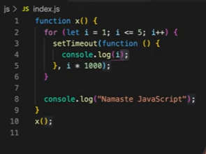
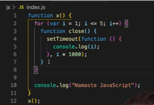
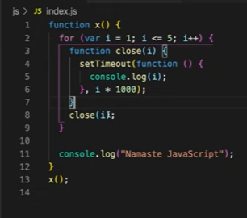
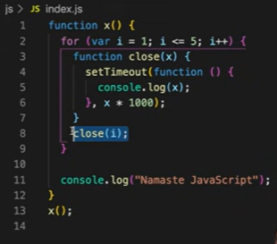

# Lesson 11: setTimeout + closures

### Fixing the problem 

- Instead of using `var`, we’ll use `let`
 

- On executing this code snippet, we get the output as
 

- We already know that `let` is block-scoped, so it means that for each iteration, `i` is a new variable altogether
- Every time the `setTimeout` function is called, it has a new copy of `i` with it
- Every time `setTimeout` is called, the callback function forms a closure with a new variable and gets stored in the memory
- For example, during the second iteration when the `setTimeout` function is called, it takes the callback function and forms a closure with the variable `i` having value 2 and this gets stored in the memory. The same thing repeats for every iteration, so by the end of it we have 5 copies of the variable `i`, each of them having a closure formed with the function

### But what if you're asked to do this using only `var`?

- In this case, only closures will come to your rescue
- Earlier we saw that when we used `var`, we were not getting the correct output because the copy of `i` was referring to the same memory location every time unlike `let` where a new copy of `i` is created every time and stored in the memory
- So if we want to do make this possible using `var`, somehow we need to give a new copy of `i` every time and form closure with the function
- To do so, we’ll enclose the `setTimeout` function in another function `close()` 
 
- To have a new copy of `i` every time, we can call the `close()` function with `i` as an argument passed to this function
 
- On executing this code snippet, we get the output as
 
- Every time the function `close()` is  called, a new copy of `i` gets supplied to the function 
- The `setTimeout` function stores the callback function with the new copy of variable `i` in a separate memory space so we get the correct output
 
- This works the same way as the previous code snippet, here a new copy of `x` is created every time  

### Resources 

- [setTimeout + closures](https://www.youtube.com/watch?v=eBTBG4nda2A&list=PLlasXeu85E9cQ32gLCvAvr9vNaUccPVNP&index=13)

