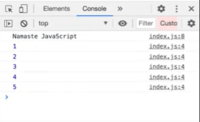
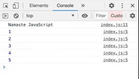

# Lesson 11: setTimeout + closures

- As we start with this session, let us take a function, 
- 

- Here, we have declared a variable `i` with any random value and we have also used a `setTimeout`. `setTimeout` takes a callback function and time in *milliseconds* as a timer. And we are trying to access the variable.
- So what should be the outcome of this snippet? Let us call the function and check
- As we have given the timer as *1000ms* which is equal to *1s*, the output is printed in the console after the timer goes off
- It means if we give the timer value as 3000 then JavaScript will print the value after 3s.
-n Let us understand it more deeply by running this new snippet
- 
 
- What will be the output for this code? Or more precisely, In what order would the console statements be executed?
- Normally we would think that JavaScript will wait for the `setTimeout` to execute and later it will print “Namaste JavaScript”, right?
- Let’s run the code and check
- 
 
- Well, let’s check behind the scenes.
- First of all the callback function forms a closure, so the function remembers the reference to `var i. Wherever the function goes it takes the reference `i` along with it.
- And what this `setTimeout` does is, it stores the function somewhere else and attaches a timer to it and JavaScript doesn't wait for this function and jumps to next commands for execution.
- Once that timer expires, `setTimeout` puts it back to the call stack and it is executed.
- Moving onto the next concept, let’s say we want print 1, 2,..,5  each number after a gap like 1 will be printed after one second, 2 after two seconds and so on.
- All cool devs would simply write a `for` loop and move the `setTimeout` into the loop, something like this
- 

- So this should give us the desired output, shouldn’t this? Nope
- This works very differently than what we expect it to do
- Let’s check,
- 

- 6? It did print the values in proper time gaps but why did it print the 6 for every iteration? All thanks to the *closure*!
- So remember what was a *closure? A function along with its lexical environment is called a **closure*. Even when a function is taken out from its original scope, executed in some other scope, it still remembers its lexical environment and has access to variables in its lexical scope.
- What happened here is
    - The `setTimeout` takes this function, stores it somewhere else and attaches a timer so that the function remembers the reference to the variable`i` not the value of `i` so when the loop runs for the first time it makes a copy attaches the timer and remembers the reference, similarly now all these 5 copies of this function all of them are pointing to same reference of `i` because they are in the same environment. 
    - JS doesn’t wait for anything right, it will run the loop again and again, `setTimeout` will quickly store one by one and javascript will just move on. It won't wait till the timer expires. So it will print namaste javascript and by the time the timer goes off it will be too late because the loop is constantly running, the value of `i` will be 6. So when the callback function runs, the value of `var i` in the `for` loop and in the reference, will be 6.
    - Thus, it will print 6 because all the 5 copies of function in `setTimeout` are referring to the same piece of reference in the memory and the variable has incremented to the value 6
### Fixing the problem 

- Instead of using `var`, we’ll use `let`
 

- On executing this code snippet, we get the output as
 

- We already know that `let` is block-scoped, so it means that for each iteration, `i` is a new variable altogether
- Every time the `setTimeout` function is called, it has a new copy of `i` with it
- Every time `setTimeout` is called, the callback function forms a closure with a new variable and gets stored in the memory
- For example, during the second iteration when the `setTimeout` function is called, it takes the callback function and forms a closure with the variable `i` having value 2 and this gets stored in the memory. The same thing repeats for every iteration, so by the end of it we have 5 copies of the variable `i`, each of them having a closure formed with the function

### But what if you're asked to do this using only `var`?

- In this case, only closures will come to your rescue
- Earlier we saw that when we used `var`, we were not getting the correct output because the copy of `i` was referring to the same memory location every time unlike `let` where a new copy of `i` is created every time and stored in the memory
- So if we want to do make this possible using `var`, somehow we need to give a new copy of `i` every time and form closure with the function
- To do so, we’ll enclose the `setTimeout` function in another function `close()` 
 
- To have a new copy of `i` every time, we can call the `close()` function with `i` as an argument passed to this function
 
- On executing this code snippet, we get the output as
 
- Every time the function `close()` is  called, a new copy of `i` gets supplied to the function 
- The `setTimeout` function stores the callback function with the new copy of variable `i` in a separate memory space so we get the correct output
 
- This works the same way as the previous code snippet, here a new copy of `x` is created every time  

### Resources 

- [setTimeout + closures](https://www.youtube.com/watch?v=eBTBG4nda2A&list=PLlasXeu85E9cQ32gLCvAvr9vNaUccPVNP&index=13)

