# Lesson 12: Crazy JS Interview

In this lesson, we’ll go through a bunch of JS interview questions

1. What is a **closure** in JavaScript?
- Closure is a combination of a function and its lexical scope bundled together
- Each and every function in JavaScript has access to its outer lexical environment i.e access to variables and functions present in the environment of its parent
- Even when this function is executed in some other scope and not in its original scope, it still remembers its outer lexical environment 
- Example:
    - 
- Here, we have the function `inner()` enclosed in the function `outer()`
- `inner()` forms a closure with the lexical environment of `outer()`
- In other words, `inner()` has access to the variables and functions of `outer()`
- On line number 8, the statement `outer()()` means that the `outer()` function is called along with its inner function
- Hence, on executing we get the output as
    - 
- Another way of doing the same thing could be
    - 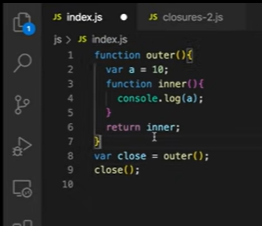
- Here, in the `close` variable the function `inner()` gets returned 
- And upon calling the `close()` function, we get the output as 10
- **add-on question**: Will it still form a closure if the variable initialization on line number 2 is moved onto line number 5?
    - 
- Yes, it will still form a closure and work the same way in this case
- So the function `inner()` forms a closure with its entire outer environment irrespective of the sequence of where it is present in the code
- On executing this code, it will give the same output as before
    - 
- **add-on question**: On line number 6, if the `var a` is changed to `let a`, will it make a difference as `let` is **block-scoped**?
    - 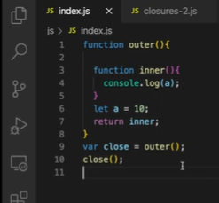
- Even if `let` is block-scoped, the function `inner()` will still have access to its lexical environment and we’ll get the same output
    - 
- **add-on question**: If the function `outer()` takes a parameter `b` then how will the closures work?
    - 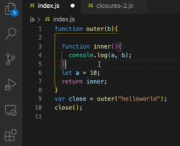
- In this case, it will work the same way as the function `inner()` will form closure with `a` and `b` both
- Even when `inner()` is returned and called outside, it will print the values of `a` and `b`
    - 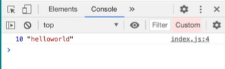
- **add-on question**: If the `outer()` function is nested  inside another function, will the `inner()` function have access to the lexical environment of that function also?
    - 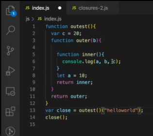
- Here, `outer()` and `inner()` are enclosed inside `outest()`
- When `outest()` is called, `outer()` is returned and when `outer()` is called `inner()` is returned
- On line number 13, the function `outest()` is being called which will return the function `outer()`
- As `outer()` is returned, we are passing “helloworld” as an argument to `outer()`
- In the variable `close`, the return value of the function `outer()` i.e function `inner()` is stored
- So even when `close()` is called outside, it still remembers its lexical environment and has access to `a`, `b` and `c`
- Hence, we get the output as
    - 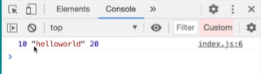
- So `inner()` has access to lexical environment of `outer()` and `outest()` both 
- **add-on question**: What if we had a global variable with a conflicting name? For example, what if we have the similar `let a` declaration on line number 12 as we have on line number 8?           
    - 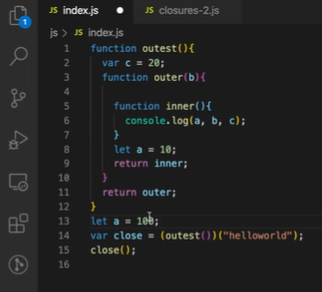                                                   
- In this case, the function `inner()` will form closure with variables `a`, `b` and `c`. 
- `a` here is having the value 10
- The variable `a` on line number 13 is a completely different variable
- When the copy of `inner()` function is given to `close`, it remembers the value of `a` which points to the `let a` declaration on line number 8
- So on executing this code snippet, we get the output as
    - 
- But in case if we didn’t have `a` on line number 8 then what would happen?
    - 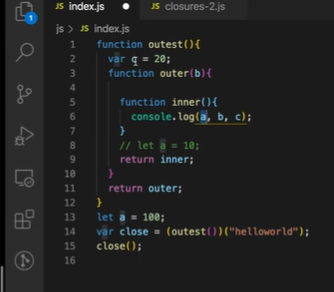
- In this case, what will happen is the JavaScript engine will try finding `a` first in `outer()` function, if it doesn’t find it there it will move to `outest()` function, if it doesn’t even find it there then it will start searching for `a` in the global scope
- As we have `a` in the global scope with value 100, it will fetch that value and print it on the console
    - 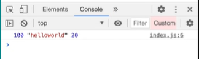
- But if we didn’t even have `a` in the global scope then what would happen?
    - 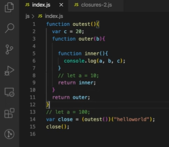
- In this case, the JavaScript engine will throw a `ReferenceError` saying that `a is not defined`
    - 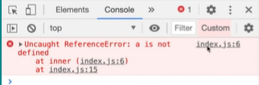
- **add-on question**: What are the advantages of closures?
- Closures has many advantages like:
    - Closures are used in Module Design Pattern
    - Function currying
    - Closures are used in higher order functions like `memoize` and `once` 
    - Data hiding and encapsulation
- **add-on question**: What is data hiding and encapsulation?
- Suppose if we have a variable and we want to have some data privacy over it so that other functions or other pieces of code don’t have access to that particular variable. This is known as **data privacy** or **data hiding** 
- Example:
    - 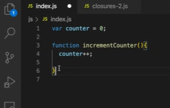
- Here, the problem is that the variable `counter` can be accessed anywhere in this program and it can also be changed
- So here comes **data hiding** or **data privacy** into the picture. Here, we want to ensure that nothing else in the program can modify this `counter` variable and it can only be done by the function `incrementCounter()`
- To achieve this, we can use **closures**
    - 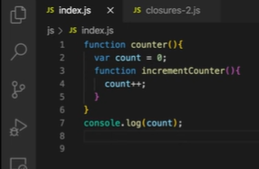
- Here, `incrementCounter()` is enclosed inside `counter()`
- So if we try to access `count` in the global scope, the JavaScript engine will throw a `ReferenceError` saying that `count is not defined`
    - 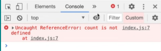
- Here the variable `count` has some privacy over it
- Right way to access `count` would be by doing something like this
    - 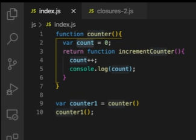
- Here, the function `counter()` is called on line number 9 and its return value  (function `incrementCounter()`) is stored in the variable `counter1`. 
- As and when `counter1()` is called, the value of count gets incremented
- On executing this code snippet, we get the output as
    - 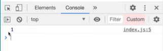
- **add-on question**: what will happen if we call the function `counter()` one more time? Like line no 9, if we invoke the `counter()` function as 
    <pre>var counter2 = counter()</pre>
    and put that result into `counter2`, explain
- We can create a new variable to access the `counter()`,  it will be independent of the previous declaration and it will again create a closure. The `incrementCounter()` will form a closure with a new `count`.
- So whenever the function is executed a new copy will be created and this `incrementCounter()` will be having a new `count` variable in return 
    - 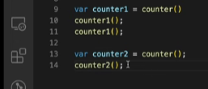 

- Now when we do `counter2() it will be having a new `counter()` so the `count++` will give us 1
    - 

- Is this a good way to make a counter? Suppose we have to make a decrement counter also, how to add that? Is your code good and scalable?
    -  This isn't a good way if we have to consider scalability. In that case we can use a constructor function and we can have separate functions for increment and decrement. We can use `this` keyword instead of returning the function while declaring the function and this will make them constructor functions. It constructs a new counter whenever the counter function is called
        - 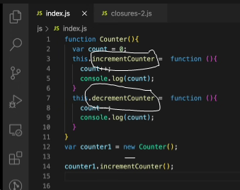
    - In this way, with the help of `counter1` we can access both the functions within `counter()` and still our data will remain private.
    - Now if we execute this code it will give us output as
        - 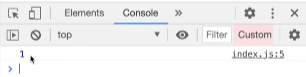

    - We can use decrementCounter function in similar fashion and it will give us the desired output
- **Disadvantages of closure**
	- There could be over-consumption of memory as closures require a bit of memory and sometimes those closed variables are not garbage collected till the program expires. If it is not handled properly then it could lead to memory leaks and browser freeze.  
- What is a **garbage collector**?
	- a program in the browser or js engine that freezes up the unutilized memory. In programming languages like C and C++, it is upto the developers that how to access, allocate and deallocate the memory but in high level languages like JavaScript most of the work is done by the JavaScript itself
    So garbage collectors are responsible to freeze up the unused variables - which are no longer of any use in the code.

- What is the relation between the **garbage collector** and the **closure**?
    - Let us understand from this example below 
        - 

    - Here we have declared a function named `a()` in which resides another function named `b()`, `b()` forms a closure with the variable `x`
    - If we try to invoke function `a()` simply by typing 
        <pre>a()</pre>
    - Then after its function `a()` execution the variable `x` must have been garbage collected right? because it is no longer needed
    - But if `x` is needed by any other inner function or it is returned by it then `x` cannot be freed
    - Thus, many closures leads to accumulation of garbage values - *overconsumption of the memory* as variables are not **garbage collected**
    - But some of the modern browsers or smart JavaScript engines like V8 and chrome they have proper garbage collecting mechanisms which somehow finds out the variables which are unreachable and smartly collects the garbage values
- What does this *‘smartly collects the garbage’* mean?
    - So let us declare one more variable named `z` which is not used anywhere within the function `a()`
        - 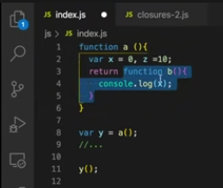
    - The function `b()` does form a closure with both the variables `x` and `z` but after `b()` is returned, `z` is no longer a part of the closure, it is garbage collected.
    - We can also check this in the browser
        - 
    - If we keep debugger on line 4, we can see that `x` is accessible
        -  
    - But `z` is not present in the memory because it was garbage collected right after the execution of the function `b()`
        -  

