# Lesson 13: FIRST CLASS FUNCTIONS ft. Anonymous Functions

### Function Statement
	
- The `function` keyword along with the *name* of the function is called the *function statement*
    - 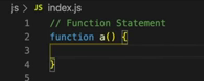
### Function Expression 
- One of the best features of functions is that we can assign a whole function as a value to a variable
    - 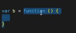

- This is **function expression** 
This is not permissible in some languages but it is allowed in JavaScript
### Difference between Function statement and function expression
 - Major difference between Function statement and function expression is **Hoisting** 
- First of all, how do we call a function 
    - <pre>a()</pre>
- Now what if we try to call the function even before it is defined? Like below
    - 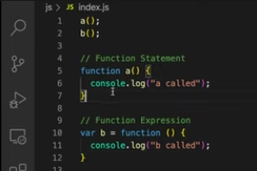

- As we learnt from the previous lectures about Hoisting, we can guess the output of this snippet
    - 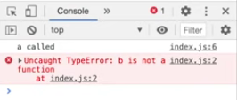

- What happened in the backstage is, `a` is allocated the memory and the function is assigned to `a` during **memory allocation phase** but in case of `b` it will be treated as a variable and assigned the value as `undefined`
- So when JavaScript executes the code line by line and reaches `var b` declaration, then only the value for `b` will be updated i.e the function will be assigned as a value
- This is the main difference between the function statement and function expression
### Function Declaration
- It is just an another jargon, **function statement** is also known as **function declaration**
### Anonymous Function
- A function without a name, without its own identity.
    - 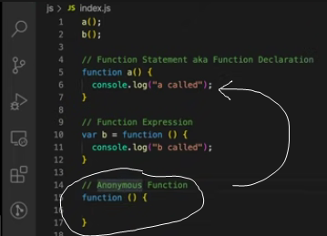

- This function looks similar to the function statement but the only difference is that anonymous function does not have a name
- If we were to execute this function, it would result us a **syntactic error**. 
    - 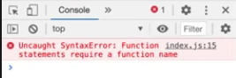

- As per the error message, anonymous functions are treated as a function statement and they *are* a type of function statement.
- According to the ECMAscript specification a function statement should always have a name.
- So what exactly is the use of anonymous functions? 
    - They are used in places where the functions are to be treated as *values*, values assigned to variables 

### Named Function Expression
- In the example of **function expression**, instead of anonymous function if we use a **named** function then it will become a **Named Function Expression**
    - 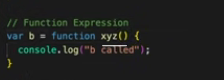

- Now this may raise a question that why or how can we give name to the function in a function expression, but this is allowed in JavaScript
But here we have a corner-case!
We can access the function `xyz()` by calling it as `b()` but what will happen if we try to call by the function’s name `xyz()`
    - 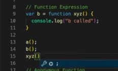

- It gives us a **reference error**
    - 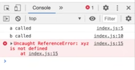

- The reason behind this is, the function `xyz()` is been assigned as a **value** so it is not allocated any memory in the *global scope*. Thus, it is not visioned as a function in the *outer scope*
It is treated as a local variable so if we want to access the function then we can access it within the function only
    - 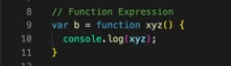
    - 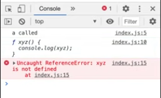

### Difference between **Parameters** and **Arguments**

 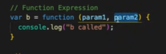
- Here, `param1` and `param2` are the identifiers or labels for that function
- These can be considered as local variables in this function’s scope
- These variables cannot be accessed outside
- So these are called as the **parameters** of a function
 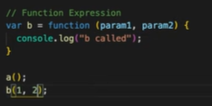
- The values that you pass while calling a function are called as **arguments**
- Here, 1 and 2 are the arguments passed to the function `b()`
- An easy way to remember the difference between the two would be - wherever you see variables present in the function definition, those are parameters and wherever you see variables or values present while calling a function, those are arguments 

### First Class Functions
- Functions in JavaScript are so flexible that a function can be passed as an argument to another function
 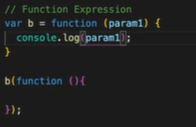
- Here, an anonymous function is passed as an argument to function `b`
- Accordingly, `param1 ` should have the anonymous function as its value
- On executing this code snippet, we get the output as
 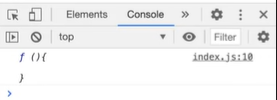
- Yes, so this is a perfectly valid JavaScript 
- Another way of passing a function inside another function is
 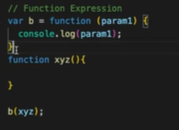
- `xyz()` is a named function and it is passed as an argument to another function `b`
- On executing this code, we get the output as
 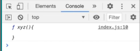
- Another stunning thing about functions is that you can even return a function from a function
 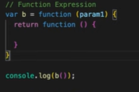
- Here, we are trying to return an anonymous function from function `b` 
- On executing this code, we get the output as
 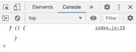
- We can also do this by returning a named function
 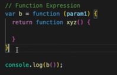
- Output:
 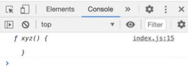
- The examples of the functions that we’ve discussed above are the nothing but the properties a **first class function** has
- <i>The ability of the functions to be used as values, passed as arguments to other functions, and to be returned from other functions makes them **First Class Functions**</i>
- **First Class Functions** is a programming concept and it is present in several other languages including JavaScript
- **First Class Functions** are also called **First Class Citizens**

### Does it make a difference if we use `let` or `const` instead of `var` in a function expression?
 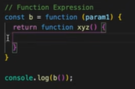
- In this case, as well it behaves the same way just like normal `let` and `const` variables do

### More about functions
- Function statement, function declaration, and function expressions can also be written using arrow functions
- Arrow functions were introduced in ES6, we’ll be learning about them in detail in our upcoming lessons

### Resources
- [FIRST CLASS FUNCTIONS ft. Anonymous Functions
](https://www.youtube.com/watch?v=SHINoHxvTso&list=PLlasXeu85E9cQ32gLCvAvr9vNaUccPVNP&index=15)
