# Lesson 14: Callback Functions in JS ft. Event Listeners 

## What is a Callback function in JavaScript?
- We already know that functions are first class citizens in JavaScript
- Being first class citizens, we know that functions can be passed to another functions as arguments
- When you do so, the function that is passed is called as a *Callback function*
- *Callback functions* are very powerful in JavaScript. It gives the access to the asynchronous world in a synchronous single-threaded language
- Recollect from our previous lessons,we've already seen that JavaScript is a synchronous single-threaded language which means that it can only do one thing at a time and in a specific order
- But with the help of callback functions, we can do async operations inside JavaScript
### Wondering why it is called as a *"callback function"*?
- Consider we have two functions `x` and `y`
- When you pass function `x` to function `y`, the passed function here is not being called directly on passing right
- Now it is upto the function `y` when it wants to call the function `x`
- Function `x` will be called back some time later in the program. Hence, it is called as a *callback function* 

### How are Callback functions used in asynchronous tasks?
- Let's  take an example
 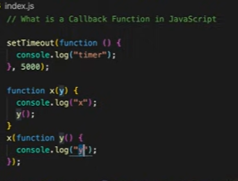
- As we know that JavaScript is a synchronous single-threaded language, the code will be executed one line at a time and in a specific order
- At first, the registering of `setTimeout` will happen
- We know that `setTimeout` accepts two parameters - 
    1. callback function
    2. time in milli seconds
 
- `setTimeout` will take that callback function and attach a timer of 5000ms to it and store it in a different space 
-  We've seen in our previous lessons that JavaScript doesn't wait until `setTimeout` finishes its execution
- In this case, as well JavaScript won't wait for the 5000ms timer to expire
- It will proceed to the next part of the program, where it encounters the function definition of `x`
- Moving on, it will then try to call the function `x` which accepts a callback function `y` as an argument
- Function `x` will complete its execution as the string "x" and the string "y"  are logged onto the console
- After some time, the 5000ms timer will expire and once that happens, the callback function which was passed to `setTimeout` will be executed
- Let's check if we get the output in the right sequence
 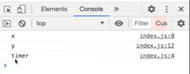
- Yes, we got the correct output
- As function `x` was executed  first, we have "x" and "y" printed on the console
- Then as the timer expired, the callback function was executed and "timer" is printed on the console
- It was not possible to have this asynchronous operation without the callback function in `setTimeout` 

### Let's dive deep into the browser to see what's happening with the call stack

 - 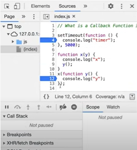
-  Here, we have kept a debugger on line number 4 and line number 12 
-  On executing the code at this point, this is what happens
- 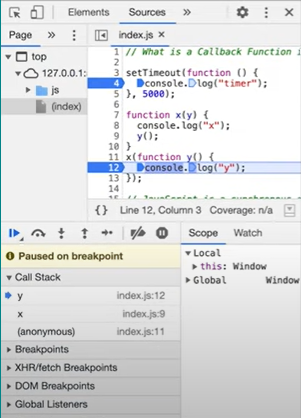
-  At first, the global execution context, execution context of function `x` and execution context of function `y` are pushed onto the call stack
 - 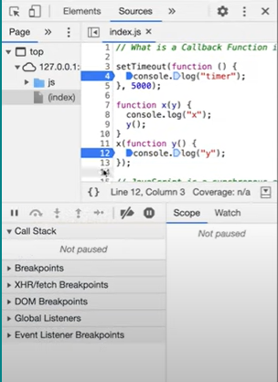
- Once, its execution is over all the three execution contexts are popped out from the call stack
 - 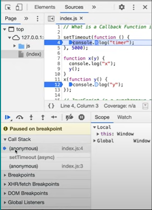
- After 5000ms (5s), `anonymous` shows up in the call stack automatically
 - 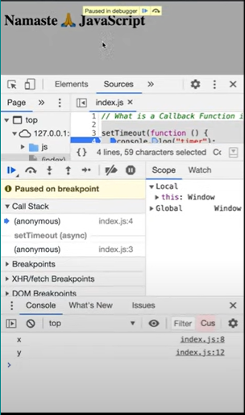
- By this time, we have “x” and “y” logged onto the console as function `x` has finished its execution
 - 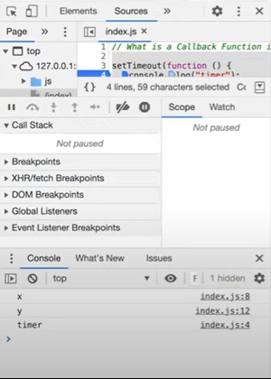
- At this point the program was paused, so when we execute the program again, callback function gets executed and “timer” is logged onto the console
-  Call Stack is also known as “main thread”
- If any operation blocks this call stack, that is known as blocking the main thread
- Suppose if we have a function `x` which has a heavy operation and it's going to take at least 20s to finish its execution
- Since we have only one call stack, JavaScript will not execute any other code until it is done executing the function `x` which means that everything else will be blocked on the code
- But it's never a good idea to block the main thread
- We should always try to use async operations for the things which take time
- Because of web API’s like `setTimeout` and callback functions, we can achieve asynchronous operations in JavaScript  

### Moving onto the event listeners
- Let us go to the index.html where as of for now only “Namaste JavaScript” is printed
- We will create a button element with an id as “clickMe” and attach an event listener.
    - 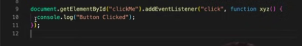
 
- On the action of “click” on the button element it will invoke the function. Now, what is that function? It is a **callback function**. Again this callback function will be stored somewhere and when the action or the event takes place then this **callback function** automatically comes into the **call stack**
    - 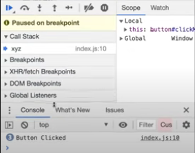

- Let us see a closure’s demo along with event listeners
    - : suppose if we have to count how many times the button is clicked and print the same. In short the counter should increase its value by 1
    - For the counter we can simply create a global variable 
        - 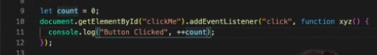

    - And increment the counter and print it on the browser  
    - But we know that using global declaration is not a good practice so how can we make a closure and ensure that the `count` is secure and cannot be modified from anywhere else in the code?
    - For that let us wrap the whole event listener within a function again
        - 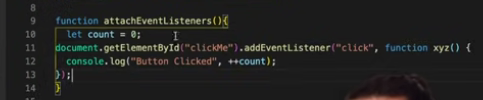

    - Now the callback function here is forming a closure with the `count` 
    - So let us run and check the changes occurring in the **call stack**
        - 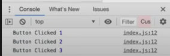

    - We are getting the output as above lets keep a debugger on the console statement
        - 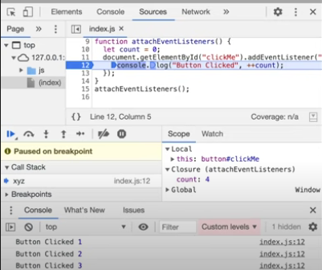

    - Here we can see that the callback function `xyz()` is present in the **call stack** and has access to the closure. And this closure has the location of `count`.
    - So whenever the event “click” takes place the callback function remembers the `count` and its value is incremented 
    - Coming onto the **Element** tab, if we click on our button element, below in the console we can see that an **Event Listeners** tab is created. Here all the event listeners attached to the selected element will be displayed.
        - 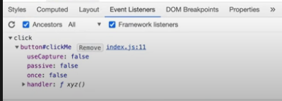

    - Our *event* listener is been registered here, within the **click**, we have the element along with its *id* and there’s the description about this event listener and here we can check, the *handler* is our callback function `xyz()`
    - If we dive deeper into the *handler* option
        - 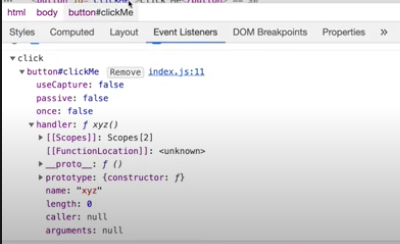

    - It shows us the scope of our callback function
    - And what is within its *Scope*? **Global Scope** and the *Closure*. **Closure** will be containing parent’s scope and its parent’s parent scope.
        - 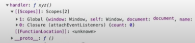

- One of the most important interview questions asked from this topic is “Why do we need to remove event listeners?”
- Event listeners are actually *heavy* in the sense of memory.
- The event listener forms the closure. But even when we are not executing the code or havent started executing yet and the call stack itself is empty, the event listener isn’t freeing up the memory. 
- It holds onto the memory because the code doesn't know when a user might click onto the button and we may need the closure.
- So this is the main reason why people remove the event listeners in certain events 
- But what if we have around hundreds of buttons and hundreds of event listener attached, then these event listeners will take up most of the memory and this will lead to slower performance of the page 
- Hence, the good practice is to remove the event listeners. Once they are removed then all the variables which was held by the closure will be garbage collected

#### Resources 
- [Callback Functions in JS ft. Event Listeners | Namaste JavaScript Ep. 14
](https://www.youtube.com/watch?v=btj35dh3_U8)
