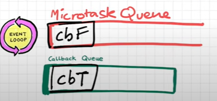

# Lesson 15: Asynchronous JavaScript and Event Loop

Let’s discuss more examples to understand the concept better

### Example 2:
 
 

- In the code, we are console logging something in the start then we are referencing to the Html element (button in this case) by using `document.getElementById`
- The button is also having a `click` event handler attached to it. On clicking the button, the callback function will be executed
- Let’s go through each line of code and understand how event loop works
- On executing the code, we know that a global execution context will be created and pushed onto the call stack
 
- As the code moves line by line, it encounters the console log statement so it calls the Web API’s console log method which logs the value passed to that method in the console of the browser
 
- Here, the Web API’s console log method is giving access to use the browser’s console and log the value provided
 
- The element to which the arrow is pointing to, we’ll consider it as our console
- As we can see, “Start” has been printed on the console
- Now the code moves to the next line, where it encounters the `document.getElementById` and `addEventListener`. Both of these are Web API’s which are given by the browser to the JavaScript engine
- `document` refers to the DOM API, DOM is document object model  
 
       
- DOM API tries to access the Html code and find out the button with the specified id or class and returns it 
- `addEventListener()` is a Web API that attaches an event Handler to the Html element 
 

- `addEventListener` registers the callback function in the Web API’s environment and attaches the `click` event to it
- Once that is done, JavaScript engine moves to the next line of code where a console log is taking place 
 

- As we can see, the console log statement has been executed and “End” is printed on the console
 

- Now as there’s nothing left to execute, the global execution context will be popped off the stack
- But remember, we have a callback function along with the click event in our Web API’s environment?
- It will continue staying there until and unless it is explicitly removed 
- It is waiting for the button to be clicked
- Once, the button is clicked, the callback function is moved to the callback queue
 
 

- It goes into the callback queue, and stays there until it’s turn comes to get executed
- Now let’s talk about our super hero’s role
 

- Yes, our super hero is none other than the “*event loop*”
- The *event loop* continuously monitors the callstack and the callback queue
 

- So if this event loop notices that the call stack is empty and there’s also a function waiting to be executed in the callback queue then it takes this function and pushes it on the call stack
 
 

- The Call stack then executes the callback function and prints “Callback” on the console
- Now since the execution is complete, our call stack will become empty again

### Why do we need *Callback Queue*?
- In case the user clicks multiple times on the button, then how will we keep a track of the events clicked?
- Callback Queue helps us to do so
- On clicking multiple times, multiple callbacks will be waiting in the callback queue to get executed right
- The event loop will now check if the call stack is empty and if there’s any function waiting in the callback queue
 

- If there are functions waiting, like in this case then it will push one function at a time on the call stack and execute it, and pop off the call stack
- Likewise, all the callbacks will be pushed, executed and then popped off the stack
- As we just have one call stack and everything gets executed there one by one, so the callback queue lines all events that are called and they wait there until it is their turn to get executed

Amongst the Web API’s that we are discussing, DOM, console, `setTimeout()` works the same way but `fetch()` doesn’t work in the same manner. Let’s take another example and understand how `fetch()` works

### Example 3:
 

- In this example, we have `setTimeout()` and `fetch()` both in the code
- What is `fetch()`?
    - `fetch()` makes an API call and returns a promise
    - We have to pass a callback function which will get executed when the promise is resolved
    - By promise being resolved, it means that the data was successfully fetched and the callback function is executed
- Now let’s execute the code and carefully observe the changes
 

- As we can see a global execution context is created and pushed onto the call stack
- Then the first line of code is executed, “Start” gets printed on the console
- Moving on, next up we have the `setTimeout` 
 

- As we know that this `setTimeout` will register the callback function in the Web API’s environment and attach a timer of 5000ms to it
- Now the JavaScript engine moves to the next line, it encounters a `fetch()` function there which is a Web API, whose function is to make network calls
- It does the same thing as `setTimeout`, it registers the callback function in the Web API’s environment
 

- Here, *cbF* is the callback function of fetch and *cbT* is the callback function of `setTimeout`
- *cbT* is waiting for the 5000ms timer to expire and *cbF* is waiting for the data to be returned from the requested url (netflix in this case)
- Considering that we got the data from the netflix servers in 50ms so now it is ready to be executed i.e to be moved to the callback queue
- But surprisingly, this doesn’t happen with `fetch()`
- Just like the callback queue, we have another queue
 

- It is the *Microtask Queue*. It is exactly similar to the callback queue but it has higher priority
- Higher priority means whatever functions come in this queue, will be executed first and then the functions of the callback queue will be executed
- What does the *Microtask Queue* contain?
    - *cbF*, the callback function in case of *promises* will be moved to this microtask queue
    -  

- Then again our superhero *event loop* will keep a check on the call stack to see whether it is empty or not, and simultaneously it will also keep checking the queues to see if any functions are waiting there, if yes, then push them onto the call stack
- Consider that we got the response from `fetch()` quickly, and we are still yet to execute the last console log statement in the code 
- Suppose that there are millions of line of code that are yet to be executed after `fetch()`, and it will take some to execute these statements
 

- But we already have a callback function waiting in the microtask queue to be executed
 

- At this point, the millions of lines of code are still being executed 
- Meanwhile, the 5000ms timer attached to *cbT* has also expired
- Once it’s expired, it will be moved to the callback queue
 

- Now, these two functions are still waiting in the queue because the million lines of code are still being executed
 

- Now consider that these millions of lines of code have finished executing, and we’ve reached the last console log statement in the program
 

- “End” gets printed on the console
- Now since there is nothing else to execute after this, the global execution context will be popped off the call stack
 

- It’s time for the event loop now to do it’s job
 

- Since it is continuously monitoring the call stack, it notices that the call stack is empty and there are tasks pending in the microtask queue and the callback queue
- We know that the microtask queue has higher priority, so the event loop first pushes the *cbF* function onto the call stack
 

- Once it is on the call stack, the statements inside the function get executed, and “CB Netflix” gets printed on the console
- Upon completing its execution, cbF ‘s execution context is popped off the call stack and also removed from the microtask queue
- Meanwhile, the event loop is monitoring the call stack and the queues
- Since the callback is empty it now pushes the *cbT* function waiting in the callback queue onto the call stack
- Now the statements inside the callback function will get executed
 

- Hence, “CB SetTimeout” gets printed on the console and since we are done executing, the execution context of *cbT* will be popped off the stack 
- With this, we are done executing the entire program
Now the question arises which functions will the *Microtask Queue* contain?
 

- Callback functions which come through the *promises* and callback functions associated with the  *mutation observer* will go inside the microtask queue
- *Mutation observer* keeps checking if there’s any mutation in the DOM tree or not. If there’s a mutation in the DOM tree then it can execute some callback functions
- All the other callback functions which are not a part of *promises* or *mutation observer*, go into the callback queue
- Callback queue is also known as “*task queue*”
- Also, remember that no matter what the microtask queue will be given the higher priority
- But what will happen if one task in the microtask queue is giving rise to another task being added to the queue, and this keeps going on?
 
 
- If this happens then the functions waiting in the callback queue won’t get a chance to execute or it might take a lot of time to execute right since it’s the priority is lower than the microtask queue
- When such a scenario occurs, it’s called as  “*Starvation*” of the tasks in the callback queue

### Resources
- [Asynchronous JavaScript and Event LOOP](https://www.youtube.com/watch?v=8zKuNo4ay8E&list=PLlasXeu85E9cQ32gLCvAvr9vNaUccPVNP&index=17)
- [Loupe - visualize JavaScript code at the run time](http://latentflip.com/loupe/?code=JC5vbignYnV0dG9uJywgJ2NsaWNrJywgZnVuY3Rpb24gb25DbGljaygpIHsKICAgIHNldFRpbWVvdXQoZnVuY3Rpb24gdGltZXIoKSB7CiAgICAgICAgY29uc29sZS5sb2coJ1lvdSBjbGlja2VkIHRoZSBidXR0b24hJyk7ICAgIAogICAgfSwgMjAwMCk7Cn0pOwoKY29uc29sZS5sb2coIkhpISIpOwoKc2V0VGltZW91dChmdW5jdGlvbiB0aW1lb3V0KCkgewogICAgY29uc29sZS5sb2coIkNsaWNrIHRoZSBidXR0b24hIik7Cn0sIDUwMDApOwoKY29uc29sZS5sb2coIldlbGNvbWUgdG8gbG91cGUuIik7!!!PGJ1dHRvbj5DbGljayBtZSE8L2J1dHRvbj4%3D)

