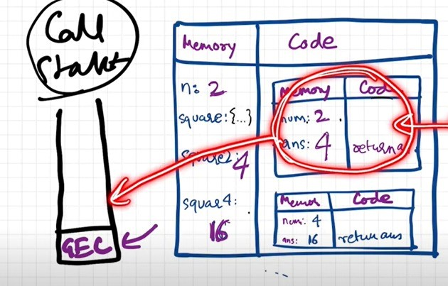
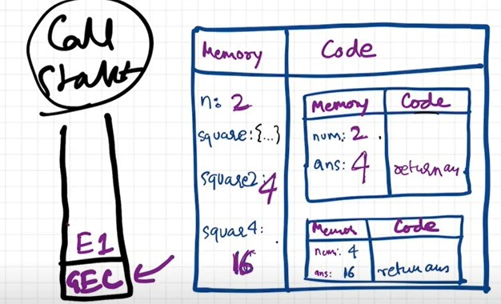
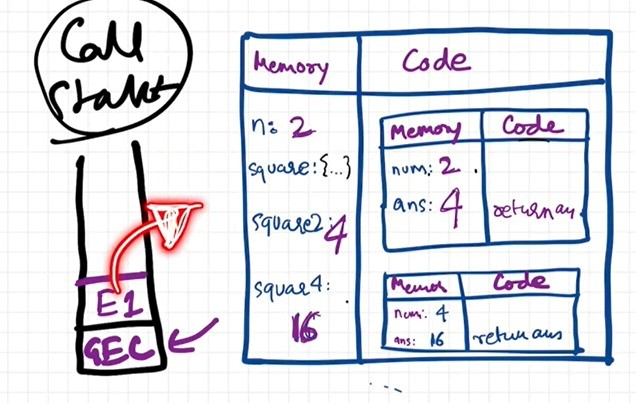
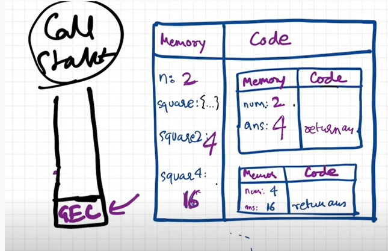

# How JavaScript Code is executed & Call Stack
## “What happens when you run JavaScript Code?”
### “Everything in JavaScript happens inside an Execution Context”
- let us take a code snippet to understand how exactly does JavaScript work in the backstage

	
- We know that, *Whenever we have to  execute a program, an execution context is created*

- Execution context contains two phases, namely :   

	  

	- **Phase I: Memory allocation phase** 
		- JavaScript allocates memory to all variables and functions in memory component.
		- In the given example, JavaScript scans the code line by line and allocates memory. On the first line it encounters variable `n` and on the next line function `square`.
		- As it allocates memory for both, in the case of variables it stores the value as `undefined` and in the case of functions it literally stores the whole function code block.
		- Similarly, it allocates memory for variables `square2` and `square4` with value as `undefined` respectively.  

			  

	- **Phase II: Code execution phase**
		- Once again, JavaScript scans the code line by line but now as it encounters the variable `n`, it replaces the value of `n` as `2` which was previously `undefined` in the allocated memory.
		- For functions, the previously stored code remains as it is, nothing to execute
		- As it encounters `square2`, there’s a **function invocation**
		- What do we mean by **function invocation**?
			- To execute the function, we need a function call. This is also known as a function invocation. 
		- Functions in JavaScript act differently from what they do in other languages
		- Functions here are like a miniprogram, whenever it is invoked, an altogether new execution context is created.
		- Now, within the global execution context, a new execution context is created which again has local memory and code components
			- **Phase I**: Here, we’ll allocate memory for the parameter and variables within the function block in memory component and its value will be our special keyword - `undefined`
			- **Phase II**: 
				- Here, for the parameter `num` we’ll have to take the value of the argument passed during invocation. The argument passed is variable `n` and as we have already stored the value for variable `n` we’ll allocate the variable `n`'s value for parameter `num`.  
				  
				- As we scan the first line within the block, variable `ans` has to store the multiplication of parameter `num`. Thus, in the code component it’ll first execute the operation and then the result of the operation will replace the value `undefined`  
				   
				- Now, the control moves onto the next line. Here, the `return` keyword tells the whole function that, return this value (`ans`) back to the place where the function was invoked. So now, within the code component it’ll execute the return statement, search for the value of `ans` in local memory and then allocate to the `square2` variable in the **global memory component**.  
				  
			- As soon as the whole function is executed, the execution context for the instance of that function **will be completely deleted**.  
			  
		- For `square4`, again we’ll repeat the process of creating a new execution context as we did for `square2`,
			- **Phase I**: Allocate memory for parameters and variables and allocate their values as undefined.
			- **Phase II**: 
				- Here, as the argument passed is the value itself, it’ll directly store the parameter's value as `4` in the memory component.
				- For `ans`, it’ll perform the operation in the code component and replace `undefined` with the result.
				- As we move onto the next line, the `return `statement is executed and the value of `ans` is returned to the place where it was invoked, at `square4`.
				- Thus, for variable `square4` the value `16` replaces `undefined`.  

					  
				
			- Again, as it finishes executing the function code, the execution context is deleted.
		- As the whole JavaScript code has been executed, the **global execution context is also deleted**. 

<i>The given example had only one function so creation and deletion of execution context seemed simple but what if a program has multiple functions and other functions being invoked within a function? Wondering how the JavaScript engine handles such a tedious task? JavaScript engine manages these things very effectively with the help of **“Call Stack”**.
</i>

### Call stack in JavaScript
- **“Call Stack maintains the order of execution of the execution contexts”**
- In order to maintain the order of execution of the execution contexts and efficiently perform creation and deletion of the execution contexts JavaScript uses **Call Stack**

  

- Call Stack is also called as:
    - Execution Context Stack
	- Program Stack
	- Control Stack
	- Run time Stack
	- Machine Stack
- The global execution context is present at the base of the stack
- The newly created execution context is placed at the top of the stack and once the execution is completed, it is popped from the stack
- In the given example,the global execution context is at the base of the stack 

    
- On line number 6 when the square function is invoked, an execution context (E1) is created and placed on the top of the global execution context.

    
    
- Once it’s execution is completed, it is removed from the top of the stack and the control returns back to the global execution context

    
    

- Then on line number 7, square function is invoked again so execution context (E2) is created and placed on the top of the stack.

    
    

- Once it’s execution is completed it is popped from the stack and the control moves back to the global execution context

    

- Once the program is executed completely, global execution context is also popped from the stack and the call stack becomes empty.

    

