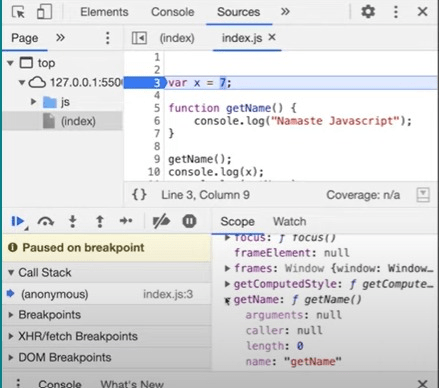
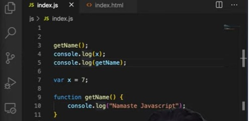
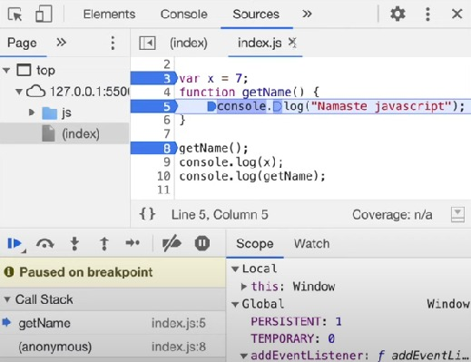

# Lesson 3 : Hoisting in JavaScript
To begin, let’s look at some Javascript code and it’s output

- <figcaption>Code</figcaption> 
  
  
- <figcaption>Output</figcaption> 
  

- In the code snippet, we have just initialised a variable `x` and the function `getName()`. Here, we are invoking the function and printing the value of the variable
- The output is very obvious and can be easily understood. Now let's look at the same example again, but this time with a twist.

- <figcaption>Code</figcaption> 
  
- <figcaption>Output</figcaption> 
  

- In this example, we are trying to access the function `getName()` and the variable `x` even before they have been initialised.
- From the output we can see that when `getName()` was invoked, it could access the function `getName()` defined in the code and print it’s output but for `x` the output is `undefined`.

-  Accessing even before initialising would result in errors  in most programming languages. However, all of this magic is possible in JavaScript because of **“Hoisting”**.

### What is *hoisting* in JavaScript?
- **Hoisting** is a phenomenon in JavaScript by which you can access the variables and functions even before they have been initialised or defined and this would not result in any errors.

- Let’s see what happens when we console log a function

- <figcaption>Code</figcaption> 
    
- <figcaption>Output</figcaption> 
    
- As we can see from the output, it prints the function itself. But what if we try to console log this function even before it has been initialised?
- <figcaption>Code</figcaption> 
    
- <figcaption>Output</figcaption> 
    
- Earlier when we tried console logging the variable `x` before initialising, it was giving the output as “u`defined” `but when we did the same with the function` getName(`), we can see that JavaScript was able to access the function and print it’s output. 
- To have a better understanding of what’s happening and why the program is behaving this way, we need to recollect the concept of *“execution context”*.

- Let’s debug the code and see what exactly is happening
    
    
- Global scope here is nothing but the *“memory”*.

    
    
- In the concept of execution context we have already seen that JavaScript skims through the whole program and allocates memory to the variables and functions even before executing the program.
- Here the debugger is on the first line of the code and even before it executes the first line we already have the variables and functions in the memory space. 
- If we dig a little deeper into the global scope, we can observe that here the variable` `x has already been allocated memory space with the value` undefine`d and we also have an actual copy of the function` getName(`) in the memory. 

- Now let us debug what happens in the memory when we try to access the variables and functions before they have been initialised

  

- Again the same thing will happen here, even before executing the first line of code where the function` getName(`) is invoked, memory will be allocated to the variables and functions. With` `x having the value` undefine`d and an actual copy of the function`getName()`  being stored in the memory.

### Difference between undefined and not defined

Let us see one more variation of the same code
- <figcaption>Code</figcaption> 

   
 - <figcaption>Output</figcaption> 
    

- Here when we debug from the first line, the memory gets allocated only to the functio `getName()`n and there is no reserved memory for the variable` `x as it has not been defined in the code
- When we try to console log the variable` `x, JavaScript throws an` Reference Erro`r saying that` x is not define`d, that is because x is not present in the memory.
- Clearly, not defined here indicates that it is not present in the memory and undefined represents the special value given to the variable in the memory allocation phase of the execution context.

- There are many ways to declare a function 
    - A function as a statement
    - A function as an expression
    - A function as an arrow function
    - A function created using the Function constructor

- Here, we will compare and observe the differences between declaring a function as a statement and declaring it as an arrow function and how it will affect its memory allocation in the global scope. 
- As we have seen previously when a function is declared as a statement, then, even if we call the function before its initialization, a  basic format is stored in the global scope. 
- The call gets executed.
- But, when we switch to declaring it as an arrow function like this, 

     

- It gives an error! 

     

- Why does it say that it is not a function? 
    - The reason, when we declare it in this way, like an arrow function, it behaves like a variable. 
    - Thus, as we learned that in the execution context's memory allocation phase, the variables are allocated the value as `undefined`. Similarly, `getName()` also gets value allocated as `undefined`.

- Now, we will declare another function named `getName2()` as a statement. let us observe how it gets allocated in the scope.
     
     
 

- It gets allocated in the basic format of a function.

- When we declare the function as an expression like given below,
     

- Also, In this case, similar to arrow functions, the function `getName2()` would be treated as a variable and, the value allocated will be `undefined`.

- Thus, in this way, we can even access the variables and the functions even before they are initialized

### Call stack demo

- Let us use this code snippet to understand how to call stack gets implemented in real
     

- As we run this code snippet, a Global execution context might be created somewhere 
     

- The global execution context was created, within the call stack and, the control is on line 3 of the code.
     

- Let's keep a debugger on line 8, we know that, whenever we come across a function invocation, a brand new execution context is created and it is pushed onto the call stack.
     

- We’ll keep the debugger on line 5 now, as the function was invoked the control shifts to line 5, and the brand new global execution context `getName()` is also created and visible in the call stack.
         

- Keeping a debugger on line 9, in the previous step, we saw that the control was on line 5 which means, the function `getName()` will be executed. Once the function  `getName()` gets executed, its execution context will be deleted, or for our understanding, we can say it gets popped off from the call stack.
     

- The function is executed, successfully. The call stack's local execution context was popped. Line 9 returns the control to the global execution context.

- Resources
  - [Hoisting in JavaScript (variables & functions)](https://www.youtube.com/watch?v=Fnlnw8uY6jo&list=PLlasXeu85E9cQ32gLCvAvr9vNaUccPVNP&index=4&t=2s)
