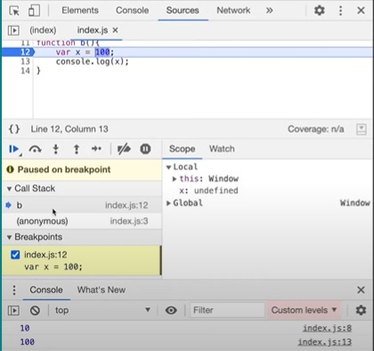

# Lesson 4 : How functions work in JS and variable environment

### Function invocation: behind the scenes
- First we need to understand the concept visually for that purpose let us take a scenario where we create a function named `a()` and another function named `b()` 
- In both the functions we will declare and initialize a variable. But, in both of the functions we will name the variable as `x`, how will JavaScript handle this situation?
- What if we also declare and initialize the variable `x` in global scope?
- Let us run this code snippet and check out for our queries

    
- output
    
    
- So this is the output we got 
- Let us dive into behind the scenes
- As we know, whenever JavaScript runs a code, a global execution context is created.
- Again we know, there will be two components, memory which is also known as *variable environment* and the code component.

    
- So now in the first phase, JavaScript will allocate the memory to the variable `x` and functions `a()` and `b()`
- As previously we have learnt that, the variables get allocated a special keyword `undefined` and the functions will be stored as it is.

    
- Also we have learnt about *Call Stack* right? *Call Stack* is a stack where all the execution contexts are stored. As soon as our global execution context was created, it got pushed onto the *Call Stack*. 

    
- Now, when we run the first line `var x=1;`, variable `x`’s value in the memory component whose value was allocated as `undefined` would be replace by value `1`

    
- Moving onto next line, there’s a *function invocation* for function `a()`, again a local execution context is created along with its two components - memory allocation and code execution
- This newly created execution context is pushed onto *Call Stack*

    
- And the control is given to line 7

    
- Now, this brand new execution context will be limited to the function `a()` only.

    
- Within the function `a()`, all the variables will get allocated within the memory component of local execution context.
- The newly created local execution context is independent of anything and acts as a separate entity.
- Variable `x` won't create confusion with the global scope variable as this variable within the function block will be treated as a new, different element.
- About the control, for global execution context, the control is on line 2 as the function was invoked on line 2 and for the local execution context for function `a()` the control is on line 7.

    
- As it executes line 7, the variable `x` is updated with new value as 10

     
- For next line, console.log statement, JavaScript looks for the value of `x` in the local memory, thus, proving its limitation to that context.
      
      
- JavaScript looks for the value of `x` within the local memory and executes the statement to print the value in the console. The value 10 will be printed in console
- As the whole code within the function `a()` is executed completely, the local execution context will be deleted and also popped off from the *Call Stack*
      
      
- As the control returns back to global execution context, to line 3, we again encounter an invocation for function `b()`
- Again the same steps for function `a()` would be repeated. A new local execution context will be created and it will be pushed onto the *Call Stack*
      
- In the *Call Stack*, now, the control is with the function `b()`, on line 12.
- Again, the variable `x` in function `b()` will be first allocated as `undefined` and later on redefined as 100
- Console statement will be executed by printing the value of `x` as 100, in the console.
- As the whole function has been executed, the local execution context for function `b()` will be deleted completely and returning back to global execution context, control is given to line 4
      
- Now, for the console statement on line 4, JavaScript takes the value of `x` from the global memory as 1 and executes the command by printing it in the console.
      
- JavaScript observes that, further, there's nothing to execute beyond line 4.
Thus, the execution is completed and now the global execution context is also deleted.
      
- Also, the global execution context is popped off from the *Call Stack*

Now that we’ve seen how things happen visually, let’s look at how these things actually happen in the browser by debugging the code
      

- Here, the debugger is on the first line of code and we know that once we run the code a global execution context will be created and pushed onto the *call stack* 

   

- Once we run the debugger, we can see  that an execution context `(anonymous)` is pushed onto the call stack and the control is on line number 1
-  We already know that once the execution context is created, memory gets allocated to the variables and functions

    
    
    

- As we can see memory has been allocated to function `a()` , function `b()` and variable `x`

    
- As we put the debugger on line number 2,  line number 1 gets executed  and the value of variable `x` in the memory which is `undefined` is replaced by 1  
- Now the control moves to the second line where the function `a()` has been invoked

    

- To get a better understanding of what happens when the function `a()` is invoked on the second line, we’ll keep the debugger on line number 7 where the function `a()` has been defined and see what happens.
- When we run the code, an execution context `a` gets created and is pushed onto the call stack as we can see above in the call stack section of the browser and the control now moves to line number 7
- As we can see that there are now two execution contexts present in the call stack where the global execution context(anonymous) has its own memory space and the newly created execution context `a` has its own memory space
- Memory space of global execution context `(anonymous)`
 
  

- Memory space of execution context `a`

  

- In the scope of the execution context `a`, we can see that there is a local memory and a global memory 
- We can notice that x has the value `undefined`, that is because the code is still in the first phase i.e memory allocation phase of the execution context

  

- As we execute the next line, the value of variable `x` which is `undefined` gets replaced by 10
- As line number 8 gets executed the control will again move back to line number 2

  
- Now as we put the debugger on line number 3 and execute the code, 10 gets printed on the console and the execution context `a` gets deleted from the call stack
- Now again the function `b()` will be invoked so let's put the debugger on line number 12 and notice the changes

  
- As we execute the code, a new execution context for the function `b()` gets created and is pushed onto the call stack
- Since we are still in the memory allocation phase of the execution context, we can see that x is having the value `undefined`

  
- Now as we execute the next line, the value of `x` gets replaced by 100  
- When the console log will be executed the control will again move back to line number 4 

  
- The debugger is on line number 4, now when we run the code 100 gets printed on the console and execution context `b` is popped from the call stack

  
- Once line number 4 gets executed, the execution of the entire program comes to an end which means that now the global execution context is also popped from the call stack and 1 gets printed on the console

- In this way, JavaScript creates its own space for every function and executes the whole program and the variables declared inside the function are limited only to its local scope

- Resources
  - [How functions work in JS and variable environment ](https://www.youtube.com/watch?v=gSDncyuGw0s&list=PLlasXeu85E9cQ32gLCvAvr9vNaUccPVNP&index=5)

