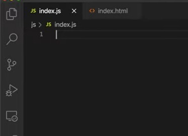
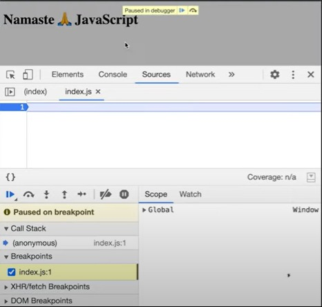
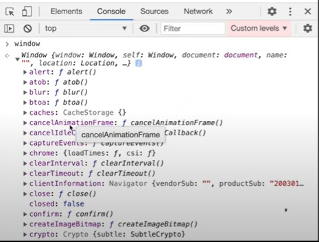
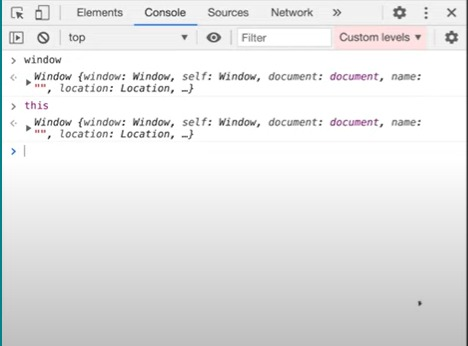
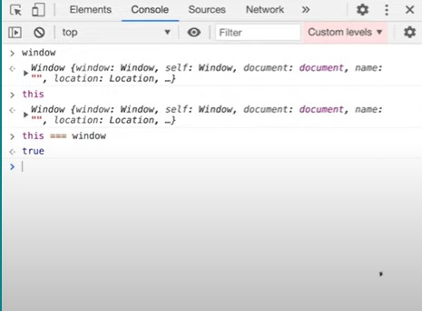

### Have you ever wondered what the shortest JavaScript program is?

 

Yes, it is the *“EMPTY FILE”*

### What happens when you run this empty file?

- Even though this file is empty but still JavaScript engine is doing a lot of things behind the scenes 
- To have a better understanding of what is happening behind the scenes we’ll debug the code 
 
- By keeping the debugger on line number 1, when we execute the code a global execution context is created and the JavaScript engine also sets up the memory space. 
- Although there is nothing to execute but still JavaScript engine behaves the way it does for any normal program 
- Along with this, it also creates something known as `window`
 
 
- By console logging the `window` keyword, we get a set of functions and variables
- `Window` is nothing but a big object containing set of functions and variables
- These functions and  variables are created by the JavaScript engine in the global space and we can access them anywhere in the program
- Just like it creates this `window` by default, it also creates something known as the `this` keyword  
 
- When we console log the `this` keyword, we get the `window` object. 
- At the global level, `this` keyword points at the `window` object
- Whenever a JavaScript program is executed even if it is empty, three things are created by default
	- global execution context
	- global object
	-  `this` keyword
- JavaScript not only runs on browsers but it also runs on servers and several other devices.
- In case of browsers, this global object is the `window`
- At the global level, the `this` keyword is equivalent to the `window` object  
 
- On checking the equivalency between `this` keyword and the `window` object, it returns the results as “true”