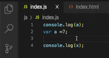

# Lesson 6 : undefined vs not defined in JS
## Introduction to undefined in JavaScript 
- Previously we learnt that JavaScript creates a Global Execution Context and allocates memory to the variables and functions even before the code is executed, here comes the special keyword `undefined` into picture.
- Let’s say that we defined a variable `a` as value 7
 
- JavaScript allocates memory to the variable `a` even before the code is executed.
- Let's put a debugger on line 1
 
- Lets refresh the page, we have not executed the code yet, but still javascript has allocated the memory for `a` as `undefined`
 
- If we try to access `a` in the console, it gives the value as `undefined`
 
- We can say that the special keyword `undefined` is a placeholder for any variable before it is initialized with any value after we start executing.
- But if we try to access any other variable, let’s say `x`, **which is not declared in the code**, will give an error as **the variable is not defined**. This happened because as we did not **declare** the variable `x` in the code, javascript also did not allocate the memory for variable `x` in the execution context. Thus, while accessing, javascript could not find the variable and gave out an error saying **it is not defined**
 
- So now when we run this snippet,
 
- We get the output as
 
- Hence, this is the difference between `undefined` and **not defined**
- Now, let's check what will be the output in the console before and after initializing the variable `a` 
 
- For the first console statement, it gives value as `undefined` as we know that in global execution context’s first phase, it allocates memory with the value `undefined`, but for the second statement, just before the console statement, the variable `a` has been initialized as value 7. Thus, for the second console statement the value `7`will be printed.
 
- The keyword `undefined` doesn't mean that the variable is empty. It acts as a placeholder for the time being, until we run the code and it gets initialized with a value.

## JavaScript is a loosely typed language
- It means that the declared variables don't belong to a specific data type
- If we have a variable which was initially having the value of a string type then it is not necessary that it can hold only string values. It can hold number, boolean or any other type of value in it
 
- Output
 >
- In the code snippet above, variable `a` was not assigned any value in the start, later it was assigned a `number` value and then a `string`. Hence, we got the output as `undefined`, 10 and hello world
- Loosely typed languages are also called weakly typed languages but that doesn’t mean that it is weak in any sense. Instead it means that the variables are not bound to a specific data type which makes the language more flexible

 
### Never make this mistake..
  

- Although `undefined` is a JavaScript keyword and it is possible to assign it as a value to a variable but it leads to a lot of inconsistencies
- Previously we have learnt that `undefined` gets assigned to a variable when no value was assigned to the variable throughout the program
- `undefined` has its own special purpose hence, it is a bad practice to assign it as a value to a variable

### Resources
- [undefined vs not defined in JS](https://www.youtube.com/watch?v=B7iF6G3EyIk&list=PLlasXeu85E9cQ32gLCvAvr9vNaUccPVNP&index=7)
