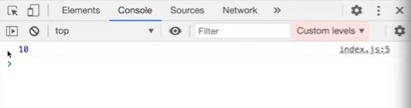
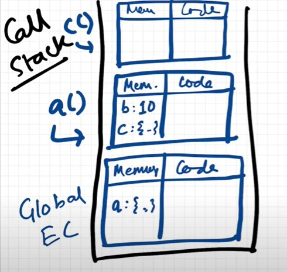

# Lesson 7: The Scope Chain, Scope and Lexical Environment

### What is Scope ?
 
- Here we are trying to see if we can access the variable `b` inside the function `a()`
- If we run this code snippet, we get the output as
 
- From the output, we can say that the `b` inside the function could somehow access the value of the variable `b` outside the function
- Let us see one more variation of this code
 
- In the code snippet given above, can variable `b` be accessed within the function `c()`?
- On executing the code, we get the output as 
 
- Based on the output, we can say that function `c()` was able to access the value of the variable `b` which is outside the function
- What would happen if we initialise the variable `b` inside the function `a()`?
 
- Output
 
- On initialising variable `b` inside the function `a()`, we can still access the value of variable `b` inside function `c()`
- We'll look at why this happens later in the concept of *lexical environment*
- But can we access the value of `b` outside both the functions?
 
- On executing this code snippet, we get the output as
 
- Oops, the output says `b` is not defined. Here comes the concept of scope into picture
- *Scope* tells us where we can access a particular variable or function inside the whole program
- There are two ways to look at it
    -  what is the scope of a specific variable i.e where can it be accessed?
    - Is the specific variable inside the scope ? (example : is b inside the scope of function `c()` i.e can `b` be accessed inside function `c()`) 

- Scope is directly dependent on the lexical environment

### Lexical Environment

Let’s understand the concept of lexical environment using a call stack
 

- When we run this program, a global execution context is created and pushed onto the call stack
 
- As we know that, JavaScript first skims through the whole program and allocates memory to the variables and functions
- Here, memory has been allocated to the function `a()`
- Next up in the code execution phase, the function `a()` is invoked and we have already learnt that whenever a function is invoked, a brand new execution context is created
 
- Initially, in the memory allocation phase of execution context `a`, value of `b` will be set to `undefined` and the function `c()` will be stored as it as
 
- When the code is executed inside the function `a()`, the value of `b` will be replaced by 10 and the function `c()` will be invoked
- As we know, on invocation an execution context for function `c()` will also be created
- Now whenever an execution context is created a lexical environment is also created
- *Lexical Environment* is the local memory along with the lexical environment of its parent
- Here, the word ‘lexical’ means ‘in hierarchy’ or ‘in sequence’
- From the code snippet above, we can see that the function `c()` is lexically sitting inside the function `a()`
- So whenever an execution context is created,along with the variables and functions in the memory space  we also get access to the lexical environment of its parent i.e the memory space of its parent
 
- So the orange block here in execution context `c` is nothing but the reference to lexical environment of 	its parent i.e memory space of `a`
- Accordingly, the other two execution context will also have reference to the lexical environment of their parents
 
- Here, `a` has the reference to the lexical environment of the global execution context
- Since the global execution context has no parent, so here the lexical environment of the parent points to `null`
- Let’s take an example to understand it better
 
- When the JavaScript engine encounters line number 5, at first it tries to find `b` inside the local memory of `c`
It won’t be able to find `b` in the local memory as it is not present then it uses the reference and goes to the lexical environment of its parent i.e it will go and search in the lexical environment(memory space)  of `a`
- Since `b` is present inside `a`, it fetches the value of `b` from there and prints it on the console
- In case if the variable `b` was not initialised in the whole program, then while executing line number 5 it would first try to find `b` in its local memory then it would move to the lexical environment of `a`. It won’t find `b` there as well then it would move to the lexical environment of the global execution context.
- Since `b` is not defined in the whole program it won’t find `b` there as well 
- Next up it will then try finding `b` in the lexical environment of global execution context’s parent which points to null
- Hence, JavaScript engine will say that `b is not defined`
- This is how scope is directly related to the lexical environment

### How scope and lexical environment works in JavaScript

- Let us understand how do we use this lexical environment in JavaScript 
    -  
- suppose we try to print `b` within the function `c()`. As javascript encounters this console statement it will first search for the variable `b` within the local memory of function `c()`  
    -  
- It wont find `b` as the variable is not declared in the function `c()` 
- So now it will take the reference and go onto the lexical environment of its parent, function `a()` 
    -  
- Function `a()` is the lexical parent of function `c()` as function `c()` is physically present within `a()` 
    -  
- Now it will search within the local memory of function `a()`
- As it found `b`it will give it back to local memory of `c()`, execute the statement and print the value on console. 
    -  
- Suppose the variable is not present in function `a()` then again it would’ve taken the reference and searched in the global  execution context’s memory component i.e lexical parent of function `a()`
- But what if the variable is not present in the global memory also ? It will again take the reference but now the reference points to null. It means that the variable was never declared in the code.
- Thus, it will give an error saying that 
**variable `b` is not defined**
### The Scope Chain
- This mechanism of finding a variable, like first, `b` was searched in local memory of `c()` then took the reference of lexical environment of `a()` and searched in local memory of `a()` because a() is the lexical parent of `c()` and if suppose the variable is absent in a(), then it will search function `a()`’s parent i.e the global context, if not found then again take the reference of lexical environment of parent but in case of global execution context reference, for the parent it refers to ‘null’, *if not found then searching in its parent, then its parents n so on* is called as **scope chain** 
    -  
- Chain of all these lexical environment and parent references is known as **Scope Chain**
- It defines whether the variable sits inside the code, if the scope chain gets exhausted while searching it means the variable is not defined in the code 
- Let us see this visualization within the browser
- Let’s keep a debugger on line 5 
    -  
- As we run this code we can see that in the call stack, all three execution context is present as we discussed it visually 
    -  
- Here, `(anonymous)` relates to global execution context;If we click on function `a` in the call stack, it shows local memory of function `a()` and its lexical environment of parent i.e global 
    -  
- Similarly, when we check for function `c`, it shows the lexical environment of parent function `a()` and lexical of environment of function `a()`’s parent, global
- So, practically function `c()` has access to all the variables throughout the code. 
    -  
