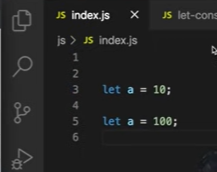
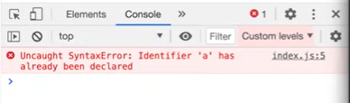
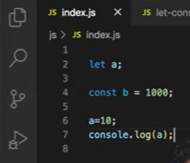
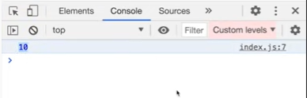
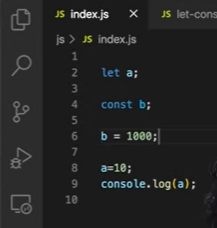
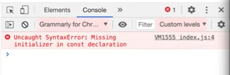
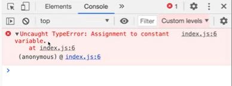
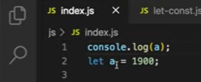

# Lesson 8: let & const in JS - The temporal dead zone

### SyntaxError vs ReferenceError vs TypeError

### SyntaxError
- A syntax error is the incorrect use of the predefined syntax
- Common examples include missing a comma, leaving off a closing brace, redeclarations, etc
- In the case of `let`, redeclarations are not allowed. 
 

- If we run the above code snippet where the variable `a` of type `let` has been redeclared, we get the following output
 
- JavaScript engine throws a syntax error if it finds a redeclaration or duplicate declaration of `let`
- Using the same variable names in the same scope is also not allowed when it comes to `let` declarations
- Example:
    <pre>let a = 10;
  var a = 100;</pre>
- On encountering a syntax error, the JavaScript engine doesn’t even execute a single line of code
- In the case of `var`, redeclarations are allowed 
- Let us see what happens in the case of `const` declarations
- Redeclarations are not allowed in `const`, as they are in `let`
- Although  `const` declarations behave the same way as `let` declarations as they are also maintained in a separate space and they also go through a temporal dead zone but `const` is even more strict as compared to `let`
 
- In the above code snippet, `let` variable `a` has been declared first, and then later it has been assigned a value. 
- On executing the code, we get the following output 
 
- If we do the same thing with a `const` declaration, it will result in an error
 
- Here, `const b` is declared first then later it is assigned a value
- On executing the code, we get the following output
 
- It throws a syntax error and as we know that whenever a syntax error is encountered no line of code gets executed
- If we read the error message carefully, it tells us that whenever you do a `const` declaration, it is necessary to assign it a value at the same time
 
- A `const` declaration like the one given above is considered valid

### TypeError
- TypeErrors are encountered when the operation could not be performed because it didn’t receive a value of the expected type
- Let’s understand type error with an example
 
- Here, we are reassigning a value to the variable `b` which is of type `const`  
- On executing we get the following output
 
- In the case of `const`, like we saw that we have to compulsorily assign a value to them as they are declared
- Similarly, reassigning  value to variables of `const` type is not allowed and hence it results in a `TypeError` as the variables are of the type `const`
- So if we want to have a variable in our program whose value remains the same throughout the program then `const` can be used

### RefernceError

- When the JavaScript engines tries to access a variable and it is not able to find it in the memory then it throws a `ReferenceError`
 
- On executing this code snippet, we get the output as
 
- Here, we get a reference error because `a` is still in the temporal dead zone 
- Another example of a `ReferenceError` is when we attempt to access a variable that has not been declared or initialized anywhere in the program.

### `var` , `let` or `const`? Which one should you use?

- Whenever you want to have a value in the program which is not going to be changed later, use `const`
- And in case you have a value in the program that is going to change later, use `let` 
- As `let` and `const` both go through temporal dead zones, there are very few chances of running into unexpected errors
- It is suggested not to use `var` or even if you are using it, use it consciously 

### Resources

- [let & const in JS - the temporal dead zone](https://www.youtube.com/watch?v=BNC6slYCj50&list=PLlasXeu85E9cQ32gLCvAvr9vNaUccPVNP&index=9)
