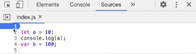
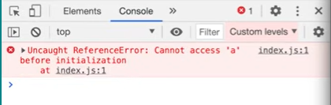

# Lesson 8: let & const in JS - The temporal dead zone
- We have learnt about **Hoisting** right? But we have seen examples of `var` declarations, what about `let` and `const` declarations? Aren't they hoisted?
- Yes, `let` and `const` declarations are hoisted but they are hoisted in a different way as compared to `var` declarations
- We can say that these are in the *temporal dead zone* for the time being.
- Let us understand this concept with the help of an example	
- 

- In this example, as we’ve previously studied, `var` declarations can be accessed even before it is initialized, why?, because the variable was hoisted and if we try to access then it will give us the special placeholder `undefined`, like this
- 

- Now, as per the presumption, `a` would also be hoisted
So if we access it before the initialization then it should also give us undefined. Let’s check for `a`.
- 

- But we got this error, this error tells us that we can access **only after we have initialized with a value**
- Let us understand more deeply by exploring into the browser
- 

- Here, we’ve kept the debugger on the very first line i.e even before executing a single line of code
As we run line 1,
- 

- We can see that, JavaScript has allocated memory for `a` as well as `b`, so both are there in the scope and values for these are `undefined`
In case of `var b`, it is allocated in the **Global Space** but in the case of `let a`, `a` is allocated under something new called *Script*.
- Why did this happen? 
  - In the case of `var b` it is allocated in the **global space**. means it is attached to the global object
  - But for `let a` it is also hoisted but they are stored in a different memory. Thus, we cannot access `a` before it has been initialized or assigned any value.
- Let us execute the code line by line and understand behind the scenes
- 

- Here, the line no 2 was executed and the value 10 was assigned to `a` 
And now if we run line no 3, it will print the value 10
- 

### What is a temporal dead zone?
- It is the time since when the let variable is hoisted, till it gets initialized with a value 
- 

- Let us use this example, we have kept the debugger on line no 1, yet to execute the code
- So in this stage, `a` is hoisted in a separate space.
- The time period from this stage till the execution  reaches line no 3 and assigns the value to `a` is called as **temporal dead zone**
- Now if we run the first line, it will give us an *ReferenceError*
- So whenever we try to access an element which is in the **temporal dead zone** it will give us a **ReferenceError**
- 

- But if we access a random variable which is not there in the code, for example let’s print the variable `x` 
- 

- 

- It gives us a **ReferenceError** saying that the random variable `x` wasn’t declared before, **is not defined**, as it was not defined, JavaScript couldn’t find its reference.
- Hence, it throws a **ReferenceError** 
- Now in case of `let a` the **ReferenceError** we got gives us a different message, it clearly states that we cannot access it before its initialization and it is in its **temporal dead zone**

### Relation of global object and variables var, let & const

- As we have previously learnt that `var` declarations are attached to the global object `window`, so we can access these `var` declarations using dot operator 
- 

- But remember, Variable `b` was allocated within the global space and variable `a` was allocated in a separate space ? So if we try to access `a` in this similar fashion then it will give us value `undefined`, as it isn’t present in the global space
- 

## SyntaxError vs ReferenceError vs TypeError

### SyntaxError
- A syntax error is the incorrect use of the predefined syntax
- Common examples include missing a comma, leaving off a closing brace, redeclarations, etc
- In the case of `let`, redeclarations are not allowed. 
 

- If we run the above code snippet where the variable `a` of type `let` has been redeclared, we get the following output
 
- JavaScript engine throws a syntax error if it finds a redeclaration or duplicate declaration of `let`
- Using the same variable names in the same scope is also not allowed when it comes to `let` declarations
- Example:
    <pre>let a = 10;
  var a = 100;</pre>
- On encountering a syntax error, the JavaScript engine doesn’t even execute a single line of code
- In the case of `var`, redeclarations are allowed 
- Let us see what happens in the case of `const` declarations
- Redeclarations are not allowed in `const`, as they are in `let`
- Although  `const` declarations behave the same way as `let` declarations as they are also maintained in a separate space and they also go through a temporal dead zone but `const` is even more strict as compared to `let`
 
- In the above code snippet, `let` variable `a` has been declared first, and then later it has been assigned a value. 
- On executing the code, we get the following output 
 
- If we do the same thing with a `const` declaration, it will result in an error
 
- Here, `const b` is declared first then later it is assigned a value
- On executing the code, we get the following output
 
- It throws a syntax error and as we know that whenever a syntax error is encountered no line of code gets executed
- If we read the error message carefully, it tells us that whenever you do a `const` declaration, it is necessary to assign it a value at the same time
 
- A `const` declaration like the one given above is considered valid

### TypeError
- TypeErrors are encountered when the operation could not be performed because it didn’t receive a value of the expected type
- Let’s understand type error with an example
 
- Here, we are reassigning a value to the variable `b` which is of type `const`  
- On executing we get the following output
 
- In the case of `const`, like we saw that we have to compulsorily assign a value to them as they are declared
- Similarly, reassigning  value to variables of `const` type is not allowed and hence it results in a `TypeError` as the variables are of the type `const`
- So if we want to have a variable in our program whose value remains the same throughout the program then `const` can be used

### RefernceError

- When the JavaScript engines tries to access a variable and it is not able to find it in the memory then it throws a `ReferenceError`
 
- On executing this code snippet, we get the output as
 
- Here, we get a reference error because `a` is still in the temporal dead zone 
- Another example of a `ReferenceError` is when we attempt to access a variable that has not been declared or initialized anywhere in the program.

### `var` , `let` or `const`? Which one should you use?

- Whenever you want to have a value in the program which is not going to be changed later, use `const`
- And in case you have a value in the program that is going to change later, use `let` 
- As `let` and `const` both go through temporal dead zones, there are very few chances of running into unexpected errors
- It is suggested not to use `var` or even if you are using it, use it consciously 

### Resources

- [let & const in JS - the temporal dead zone](https://www.youtube.com/watch?v=BNC6slYCj50&list=PLlasXeu85E9cQ32gLCvAvr9vNaUccPVNP&index=9)
