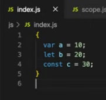
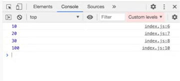

# BLOCK SCOPE & Shadowing in JS
### What is a block in JS?
- The below snippet is a perfectly valid code, anything enclosed within curly braces is called a **block**.
- A block is also known as compound statement
    - 
- What is the purpose of a block ?	-
    - A block is used to combine multiple JavaScript statements into a group
- Why do we need to group the statements?
    - We group it so we can use multiple statements where JavaScript expects only one
- For example if we run the given snippet
    - 
    It will give us a **syntax error** as,
    - 
    - Because it expects at least one statement to execute. But what if we have multiple statements to execute? All those statements can be written within a block and it will treated as a single statement
    - Thus, the main purpose of block is grouping of multiple statements and it can be used for control statements  and conditional statements
### What is a block scope?
- **Block Scope is what all variable and functions we can access within that block**
- To understand this let us declare the variables in `var` `let` and `const` and observe how they behave within the block and what happens behind the scene.
    - 
- So here we have declared `var a`, `let b` and `const c`, moving onto the browser, let us keep a debugger on line 2
    - 
- As we see, both `let` and `const` declarations are hoisted in *Block Scope* with value as `undefined`, this a separate space that is **reserved for this block only**.
- Thus,  we say that `let` and `const` are **Block Scoped** and they cant be accessed outside the block whereas, `var` declarations are accessible anywhere in the code.
- Let us again take an example to understand.
    - 
- When we run this above snippet we get the output as.
    - 
- JavaScript prints the value of all three variables when it executes the console statements which are present within the block but when it executes the console statements present outside the block then only `var` declaration `a`’s value is printed for `let` and `const` declaration it throws an error saying those variables are not defined
- For `var` declaration it is understood that it is globally scoped so it was accessible but what happened `let` and `const` declarations
- Let us check the browser, keeping debugger on line 10,
    - 
- Here we see that, as soon as the block was executed, it is no longer present in the scope and only Global Scope remains 
- Thus, only the `var` declaration was accessible.
 

 

### What is shadowing in JS?
 
- Here, the variable `a` inside the block scope is shadowing the variable `a` outside the block scope
- On executing the above code, we get the output as
 
- In this case, the value of variable `a` in the global scope was modified to 10 because `a` inside the block scope and outside of it, is pointing to the same memory space i.e Global
 
- As we can see, `a` is present in the global scope, and before executing line number 3, its value is 100
On executing line number 3, its value changes to 10
 

Let’s see what happens when we do the same thing with `let`
 
- On executing the code, we get the output as
 
- Here, when `b` is logged inside the block scope, its value is 20 but when it is logged outside the block scope i.e inside the global scope, its value is 100
- Let’s debug and see why this happened 
 
- By keeping the debugger on line number 6, when we execute the code we see that we have three different scopes
- Here, we have the block scope where the `let` and `const` variables present inside this scope are hoisted
- Then we have the Script scope here, where the `let` and `const` variables present inside the global scope are hoisted. We have already learned that `let` and `const` are maintained in a separate memory space
- And lastly, we have the global scope in which `var` declarations are hoisted
- So here when we tried accessing `b` inside the block scope it was fetching the value from the block scope memory and printing the value as 20 
- But when we tried accessing `b` outside the block scope, it was fetching the value from the Script memory space where `let` declarations outside the block scope were hoisted, thus printing the value as 100
- Here, b’s value of 20 inside the block scope was shadowing b’s value of 100 outside the block scope
- A similar thing happens when we do this using `const`
 
- Output
 
- Shadowing is not limited to block scope,  it works the same way with functions as well
 
- Output
 
 ### What is illegal shadowing?
 Let’s see an example of *illegal shadowing*
 
- If we try to shadow a `let` variable inside a block using `var`, we get the output as
 
- It throws a error, so this counts as illegal shadowing 
- Shadowing `let` using `let` is allowed but shadowing `let` using `var` is not allowed
But can we shadow a `var` using `let`? Let’s check
 
- Output:
 
- Yes, its perfectly valid if we shadow a `var` using `let` 

Why does this happen?
- If a variable is being shadowed then it should not cross the boundary of its scope
- Taking about boundaries, we know that `var` is function scoped
- So if we do something like this,
 
- It is completely valid
- We have already learnt about *lexical scope*. Here, *block scope* also follows the principle of *lexical scope*
 
- Here, when we log the value of `a`, the JavaScript engines goes to the nearest lexical scope and fetches the value
- Hence, we get the output as
 
- Let’s debug and check the memory scope
 
- Here, we can see that there is different memory space for each block
 
- In the above code snippet, if we try to log the value of `a` we get the output as
 
- So looking at the output we can say that *block scope* follows the principle of *lexical scope*

### Resources
- [BLOCK SCOPE and shadowing in JS](https://www.youtube.com/watch?v=lW_erSjyMeM&list=PLlasXeu85E9cQ32gLCvAvr9vNaUccPVNP&index=11)